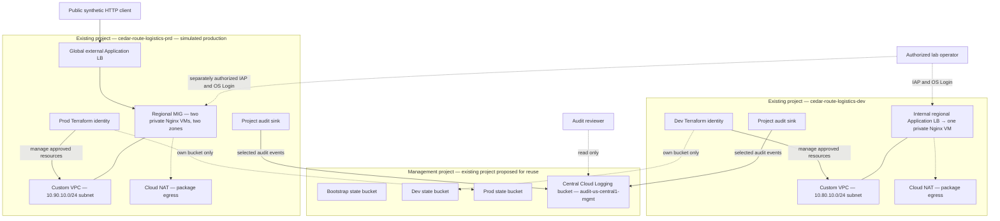

# GCP Landing Zone: Multi-Project Architecture

Historical multi-project proposal. Superseded by the [single-project architecture](../single-project-architecture.md) and its runbook. Old resource counts, deployment commands, estimates, and validation status below are not the current baseline.

Status: only the human-operated seed (arquivo histórico na recuperação privada; fora da entrega pública) was separately authorized and applied on 2026-10-03. **Three existing active projects** (management, development, simulated production) and billing links were API-verified. The owner accepted state/audit retention as recorded in [ADR 0005](../decisions/0005-bootstrap-and-session-boundaries.md); foundation review is due by 2026-11-02. Bootstrap (arquivo histórico na recuperação privada; fora da entrega pública), ingress Terraform, and an attended session controller remain local, unapplied implementations. Effective isolation, account-specific pricing, and runtime validation remain pending. No cloud deployment is authorized by this document.

All documented resource names, addresses, workloads, and operational targets are fictional. On 2026-10-03 the owner confirmed that both dev and prod projects already exist. Consume existing project IDs as private runtime inputs; do not create, import into managed project resources, or recreate projects in the bootstrap. Effective permissions, billing attachment, APIs, and existing resource conflicts remain unverified. No independent cloud inventory has been performed.

## Business purpose and decision

Cedar Route Logistics needs independently controlled development and production environments before migrating its fictional shipment-tracking and reporting workloads. Separate projects address the administrative boundary that the earlier single-project proposal could not demonstrate. The management project provides shared audit storage and Terraform state without carrying application workloads.

[ADR 0002](../decisions/0002-multi-project-foundation-lab.md) records this direction; [ADR 0001](../decisions/0001-project-level-foundation-lab.md) is superseded. The owner selected `us-central1` for regional lab resources in [ADR 0003](../decisions/0003-us-central1-lab-region.md). See the [requirements](gcp-landing-zone-requirements.md) and [validation plan](gcp-landing-zone-validation.md).

## Project boundaries

| Logical project | Intended origin | Responsibilities | Ordinary environment access |
| --- | --- | --- | --- |
| `cedar-route-logistics-mgmt` | Reuse existing project only after confirming it is a suitable personal lab | State buckets, central audit bucket, bootstrap configuration | Each environment provisioner accesses only its own state bucket; audit writers have destination write access only |
| `cedar-route-logistics-dev` | Existing project; creation confirmed by owner on 2026-10-03 | Development network, scoped identities, audit sink, temporary test endpoints | Development permissions only |
| `cedar-route-logistics-prd` | Existing project; creation confirmed by owner on 2026-10-03 | Equivalent controls for simulated production | Production permissions only |

These are logical/display names following the owner's `corporation-environment` convention, not real or reserved project IDs. Existing IDs remain unchanged and are supplied only in private inputs. No cloud rename has been performed. Terraform input keys remain `management`, `dev`, and `prod`; the display-name suffixes are `mgmt`, `dev`, and `prd`. Billing may be shared; billing access is not ordinary environment administration. Keep source projects' default audit logs intact. Never adopt an existing resource into Terraform without a separate ownership review.

Use fictional ownership metadata such as `owner=platform`, `environment=management|dev|prod`, `cost_center=cloud-lab`, and `managed_by=terraform` on lab resources that support labels; select one environment value per resource. Record unsupported fields in the inventory. Allocate shared state/logging costs to management and workload/test costs to the originating environment. Labels describe ownership and costs; they do not enforce access control.

The diagram combines resource ownership, management access, and audit flows. There is **no VPC interconnection**. State and logging are managed service endpoints, not hosts inside a management VPC. No management VPC is needed for this scope.

## Network and administrative access

Each environment has one custom-mode IPv4 VPC and one workload subnet in `us-central1`: `crl-dev-vpc` / `crl-dev-subnet` with `10.80.10.0/24`, and `crl-prod-vpc` / `crl-prod-subnet` with `10.90.10.0/24`. Dev additionally has a `10.80.20.0/23` proxy-only subnet for its regional internal Application LB. Prod uses a global external Application LB. [ADR 0004](../decisions/0004-environment-application-load-balancers.md) replaces the earlier private-probe exercise with this Nginx ingress lab.

One dev VM and two prod VMs use non-Spot `e2-micro` with 10 GB `pd-standard` disks. Prod's regional MIG spans `us-central1-a` and `us-central1-b`; dev uses `us-central1-a`. Verify image, quota, capacity, and address conflicts before apply. VMs have no external addresses. Each environment has Cloud NAT for package downloads and replacement bootstrapping; NAT is outbound, not application ingress. No peering, VPN, or Shared VPC is configured. Do not alter existing default networks.

IAP/OS Login remains the administrative path. Google's published `35.235.240.0/20` range is provider infrastructure, not fictional company addressing. [IAP forwarding](https://docs.cloud.google.com/iap/docs/using-tcp-forwarding).

| Flow | Proposed control | Evidence |
| --- | --- | --- |
| Authorized operator → probe SSH | IAP permission plus OS Login; allow TCP 22 from IAP only to probe targets | Successful authorized session; denied session for a scoped unauthorized identity |
| Dev private client → internal LB → Nginx | Internal frontend TCP 80; proxy-only subnet to backend TCP 80 | Page and token returned through the private frontend |
| Internet → prod global LB → Nginx | Public frontend TCP 80 for synthetic lab content; Google proxy/health ranges to backend TCP 80 | Healthy backends and responses carrying anonymous per-VM tokens |
| Development ↔ production | No connecting route or peering; no inter-environment allow rule | Failed private-IP probes in both directions, with endpoint health confirmed |
| VM → package repositories | TCP 80/443 egress through NAT, priority 900; other ordinary IPv4 egress denied at 1000 | Successful boot/install and controlled disallowed-port test; no claim of domain allowlisting |
| Google health checks → Nginx | TCP 80 from `35.191.0.0/16` and `130.211.0.0/22`, `/healthz` | Healthy/unhealthy transitions observed |
| Internet → VM directly | No VM external addresses; SSH allowed only from IAP | Interface inventory and effective firewall review |

Egress filtering permits web destinations broadly for signed Debian package repositories; it does not block arbitrary HTTPS destinations. Return traffic and platform-handled metadata/DNS traffic require separate consideration. Review effective rules/routes and inherited policy before testing. [Firewall behavior](https://docs.cloud.google.com/firewall/docs/firewalls).

Use a reviewed exact Debian 12 image and the Nginx startup script. The fictional hostnames are `dev.cedar-route.example` and `app.cedar-route.example`, mapped per test without public DNS. This iteration is HTTP-only, with explicit prod acknowledgement and no sensitive content. A publicly trusted HTTPS identity needs a separate domain decision. The IAP tunnel and OS Login authorization remain separate checks. [OS Login](https://docs.cloud.google.com/compute/docs/oslogin/set-up-oslogin).

## IAM and separation of responsibilities

| Logical identity | Intended permissions | Must not receive |
| --- | --- | --- |
| Bootstrap administrator | Establish reviewed lab resources, identities, grants, and destination permissions | Persistent credentials embedded in code; unattended everyday use of bootstrap privileges |
| `tf-dev` | Manage the approved development network resource set; access objects in the dev state bucket | Production grants, prod/bootstrap state access, project IAM administration, central log administration |
| `tf-prod` | Equivalent permissions scoped to production and its state bucket | Development grants, dev/bootstrap state access, project IAM administration |
| Probe operator / fixture provisioner | Time-bounded permissions for the chosen environment's temporary endpoints and administration | General project ownership, cross-environment grants, foundation IAM or state access |
| Probe runtime identity | No application API grants initially | Default broad Editor grants or state access |
| Audit sink writer | Route selected events into the configured central destination | State access, log reading, log configuration or deletion |
| Audit reviewer | Read the intended central audit view | Log modification, environment administration, state access |
| Financial reviewer | Review authorized cost information | Workload or Terraform administration |

These are capability boundaries, not claims that bindings exist. Resolve exact resource permissions and role scope in the implementation plan, checking for inherited access and impersonation paths. The dev/prod provisioners must not be able to grant themselves more permissions. Use additive, narrowly scoped grants; never replace the entire existing project IAM policy.

For probe access, map IAP tunnel access and OS Login to the selected instance/environment and add only required discovery or attached-service-account permissions. Do not grant Compute Instance Admin merely to obtain shell access when a narrower role satisfies the operation. Provisioning fixtures is a separate responsibility from logging into them. [OS Login role requirements](https://docs.cloud.google.com/compute/docs/oslogin/set-up-oslogin).

The solo owner can still administer multiple projects. Test with dedicated, scoped identities rather than the owner's broad credential; otherwise an apparent isolation result is invalid. Shared ownership does not demonstrate independent human approval. Projects form useful IAM boundaries, but inherited or explicit cross-project grants can defeat them. [IAM hierarchy](https://docs.cloud.google.com/iam/docs/resource-hierarchy-access-control).

Use short-lived credentials and service-account impersonation where applicable; create no service-account keys. A future GitHub deployment workflow must use reviewed federated authentication, with environment-specific identities. CI deployment is not part of this architecture delivery.

## Central audit logging

Create a project sink in each environment that routes selected Admin Activity and System Event audit entries directly to the `audit-us-central1-mgmt` Cloud Logging bucket in management. Use an explicit log-bucket destination, not just a project destination. Grant each sink's writer the permissions required for cross-project routing. The exact destination IAM configuration is a bootstrap responsibility and must pass a write/read boundary test. [Cross-project log routing](https://docs.cloud.google.com/logging/docs/export/configure_export_v2).

Propose 30-day retention for the custom central bucket in `us-central1`, satisfying the selected minimum window. Preserve source `_Required` buckets, their existing locations, and their platform-managed retention. Separate central-log access from environment administration. Add only event categories tied to a requirement; Data Access and flow logs need a separate coverage and cost decision. [Audit log categories](https://docs.cloud.google.com/logging/docs/audit).

The central bucket is Cloud Logging storage, distinct from the GCS state buckets. Logging API access does not require VPC peering. A source administrator can disrupt future forwarding by changing a sink; the sole management owner is not an independent security authority. Do not claim tamper-proof evidence or complete event coverage. Validate arrival, source attribution, reviewer access, and denial of destination configuration access to ordinary environment identities.

## Terraform ownership, state, and recovery

Within this Landing Zone case, use four implemented roots: `infra/seed`, `infra/bootstrap`, `infra/environments/dev`, and `infra/environments/prod`. The human-operated seed owns API enablement, the bootstrap identity, and its administrative grants. Bootstrap explicitly impersonates that identity to manage scoped environment identities/grants, state buckets, central logging configuration, and source audit sinks. Each environment root owns its network, NAT, application LB, template, and MIG, using explicit provisioner impersonation. Runtime identities and buckets are bootstrap outputs, not created by the workload module. [ADR 0005](../decisions/0005-bootstrap-and-session-boundaries.md) documents retained-state safeguards and local watchdog limitations; [ADR 0006](../decisions/0006-human-seed-and-impersonated-bootstrap.md) records the seed identity boundary, broad administrative permissions, and disabled-by-default maintenance access. Only seed has been applied; bootstrap and workload roots remain unapplied.

Use three regional GCS buckets in management, all located in `us-central1`, for bootstrap, dev, and prod state. Separate buckets allow bucket-scoped permissions; prefixes alone in one broadly accessible bucket are not the intended access boundary. Enable uniform bucket-level access, public access prevention, and object versioning. Keep state sensitive and exclude state, backend inputs, plans, and real identifiers from Git.

Bucket names follow `purpose-region-environment`, with a non-sensitive uniqueness token included in the GCS purpose component: `tfstate-crl-demo-us-central1-mgmt`, `tfstate-crl-demo-us-central1-dev`, and `tfstate-crl-demo-us-central1-prd` are fictional examples, not reserved names. Replace `demo` privately before deployment. The environment suffix identifies whose state is stored; all buckets are hosted in management. The central Logging bucket uses the same ordering, with no globally unique token needed for its project/location-scoped identifier.

Environment identities receive the object permissions their backend needs only on their bucket. No project-wide storage role is granted to them. Verify positive own-bucket access and negative cross-bucket access. GCS backends support locking and require their bucket to exist first. [Terraform GCS backend](https://developer.hashicorp.com/terraform/language/backend/gcs), [Storage role scope](https://docs.cloud.google.com/storage/docs/access-control/iam-roles).

Seed keeps separate protected local state and an independent recovery copy; it never depends on a bucket created by bootstrap. Bootstrap initially uses protected local state outside Git, then migrates it to its own backend after bucket creation, with explicit bootstrap impersonation in the backend as well as the provider. Confirm migration and a no-change plan before retiring temporary bootstrap copies; preserve seed's recovery state. Disable bootstrap access through a human-operated seed plan after foundation reconciliation, and re-enable only for reviewed maintenance. Avoid circular ownership by establishing identities and sink destinations before environment applies and confirming forwarding after source writer permissions exist.

Recovery procedure: pause applies; capture the current state generation and configuration revision; validate a prior version in an isolated recovery exercise; restore the chosen generation only after checking lineage, serial, and current resources; run a refresh/plan and reconcile before resuming. Never restore an old state over newer infrastructure without reconciliation. For this lab, propose a recovery point of the last successful state write while versions remain available, with 7 days of noncurrent-version recovery history. Validate lifecycle and soft-delete behavior before implementation; versioning is not protection against a sufficiently privileged administrator.

The fictional 8-hour configuration recovery target remains untested. It excludes recovery of deleted projects, account access, billing, and workload data.

## Enterprise reference and lab coverage

| Enterprise concern | Demonstrable lab scope | Remaining limitation |
| --- | --- | --- |
| Environment ownership | Separate dev/prod project permissions and per-environment state access | Owner can administer both; no independent team separation |
| Resource hierarchy | Three explicit project responsibilities | No organization, folders, or inherited organization-wide guardrails |
| Network security | Custom networks, approved-flow matrix, private probes, administration and negative tests | No hybrid connectivity or production application traffic |
| Audit governance | Cross-project routing and scoped review of selected audit events | No organization-wide aggregation or independent security administrator |
| Recovery and cost | Versioned state exercise, short-lived endpoints, allocation and cleanup evidence | No workload availability/DR claim or measured savings |

Folders and organization-level governance belong to the reference design. Shared VPC requires an organizational context and is not deployed here. Evaluate those additions only when their prerequisites and requirements exist. [Resource hierarchy](https://docs.cloud.google.com/resource-manager/docs/cloud-platform-resource-hierarchy), [Shared VPC](https://docs.cloud.google.com/vpc/docs/shared-vpc).

## Cost, deployment stages, and cleanup

Current work includes local ingress code but no deployed resources. The [cost and allowance plan](gcp-landing-zone-cost-plan.md) now includes billable LBs, NAT, addresses, traffic, and an optional third prod VM. The former private-probe zero-cost estimate does not apply to this topology. Verify remaining allowances and the complete estimate before deployment authorization.

Select project-scoped cost tracking and alerts with an approved amount and recipients. Alerts-only budgets provide notifications; this design does not configure an automatic spending stop. Agree a test window, manual stop condition, and cleanup owner. [Budget types and alerts](https://docs.cloud.google.com/billing/docs/how-to/budgets).

1. Verify the existing management/dev/prod projects, billing attachment, effective permissions, enabled APIs, resource conflicts, service/zone availability in `us-central1`, estimate, and deployment authorization. Project creation is no longer needed; preserve the existing project lifecycle outside workload/bootstrap state.
2. Apply the reviewed seed with human ADC to enable APIs and create/authorize bootstrap. Run bootstrap using explicit impersonation to create environment identities, separate backends, and audit routing; verify state and log permissions.
3. Complete bootstrap backend migration, preserve independent seed recovery state, and disable bootstrap access through a reviewed human-operated seed plan. Prepare separate dev/prod workload plans using their own provisioner identities.
4. Provision one dev and two prod Nginx VMs behind their respective LBs. The owner's one-hour session limit includes creation, boot, tests, and verified cleanup: up to 3 baseline VM-hours, with replacements or optional third-VM usage counted additionally inside the same window. Start cleanup by minute 40 or earlier, and skip unfinished tests rather than extending runtime. Execute the [validation plan](gcp-landing-zone-validation.md) only after the complete estimate fits the BRL 300 cumulative portfolio ceiling and cleanup controls are validated.
5. Use reviewed environment destroy plans and verify removal of MIG VMs/disks, templates, LBs, forwarding rules, NAT, reserved addresses, and networks. Disable/remove lab sinks and writer grants before removing their central destination.
6. Retain backend access until teardown verification and agreed recovery retention are complete. Inventory all retained state versions, soft-deleted objects, logs, and possible residual charges. Do not delete the existing management project or unrelated resources.

Local implementation does not authorize spending. Before apply, verify exact image/zone availability, effective permissions (including inherited grants and service agents), free headroom, account-currency rates, the accepted retention schedule, backend migration readiness, and attended cleanup readiness. Projects and billing links are owner-confirmed; no API inspection is claimed. The local watchdog cannot guarantee one-hour cleanup if the host, credentials, network, or cloud APIs fail.
